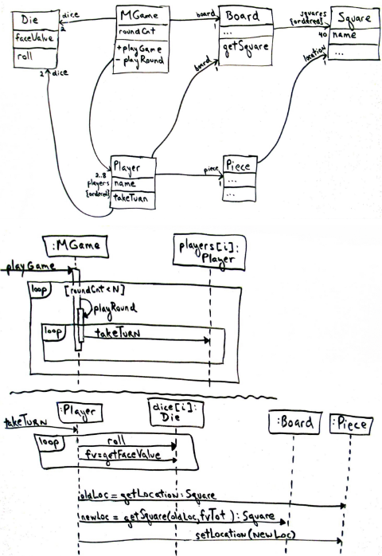

# SE
6510451000 Sittipat Tepsutar

Respository นี้ใช้ประกอบการเรียนในรายวิชา 01418471-65 Software Design and Development


## Week 1
เขียนโปรแกรมตาม Diagram ดังรูป



### ตัวอย่างผลลัพท์จากการรันโปรแกรมหลัง build

```
$ java -jar ./target/se-1.0.jar 
Input Player Count (2 to 8 players): 2 
Input Player 1's name: Bowser
Input Player 2's name: Mario
Enter Rounds (Integer): 5

 -- Game Start --

Bowser's Turn
Player Bowser's Roll Result: 5, 6, Total Face Value: 11
Piece Location: S00 -> S11

Mario's Turn
Player Mario's Roll Result: 6, 2, Total Face Value: 8
Piece Location: S00 -> S08

-- END of round --

Bowser's Turn
Player Bowser's Roll Result: 1, 6, Total Face Value: 7
Piece Location: S11 -> S18

Mario's Turn
Player Mario's Roll Result: 4, 4, Total Face Value: 8
Piece Location: S08 -> S16

-- END of round --

Bowser's Turn
Player Bowser's Roll Result: 3, 5, Total Face Value: 8
Piece Location: S18 -> S26

Mario's Turn
Player Mario's Roll Result: 6, 6, Total Face Value: 12
Piece Location: S16 -> S28

-- END of round --

Bowser's Turn
Player Bowser's Roll Result: 6, 3, Total Face Value: 9
Piece Location: S26 -> S35

Mario's Turn
Player Mario's Roll Result: 3, 1, Total Face Value: 4
Piece Location: S28 -> S32

-- END of round --

Bowser's Turn
Player Bowser's Roll Result: 2, 6, Total Face Value: 8
Piece Location: S35 -> S03

Mario's Turn
Player Mario's Roll Result: 6, 5, Total Face Value: 11
Piece Location: S32 -> S03

-- END of round --

Game Over

```

> NOTE : ลำดับการเล่นของผู้เล่นจะเรียงด้วยชื่อผู้เล่น

<hr>

### สามารถใส่ option `-p` เพื่อใช้เป็น Default Player ได้

การใช้ option `-p` จะทำให้โปรแกรมสร้าง Default Player มา 4 คน ด้วยชื่อ P1, P2, P3 และ P4<br>
ตัวอย่างคำสั่งและผลลัพท์:

```
$ java -jar ./target/se-1.0.jar -p
Enter Rounds (Integer): 1

 -- Game Start --

P1's Turn
Player P1's Roll Result: 3, 2, Total Face Value: 5
Piece Location: S00 -> S05

P2's Turn
Player P2's Roll Result: 4, 6, Total Face Value: 10
Piece Location: S00 -> S10

P3's Turn
Player P3's Roll Result: 1, 4, Total Face Value: 5
Piece Location: S00 -> S05

P4's Turn
Player P4's Roll Result: 6, 5, Total Face Value: 11
Piece Location: S00 -> S11

-- END of round --

Game Over

```
